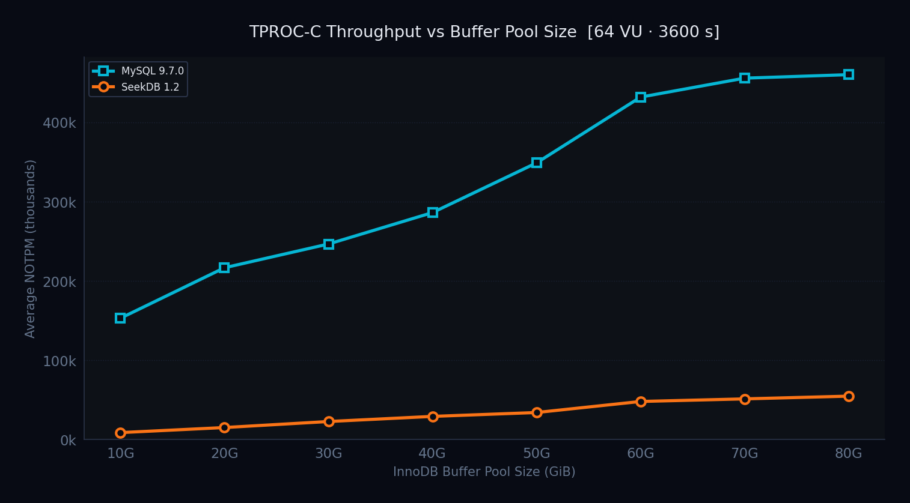
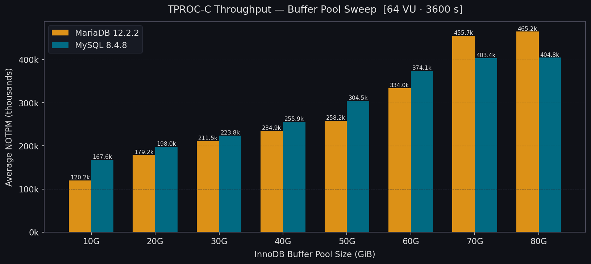
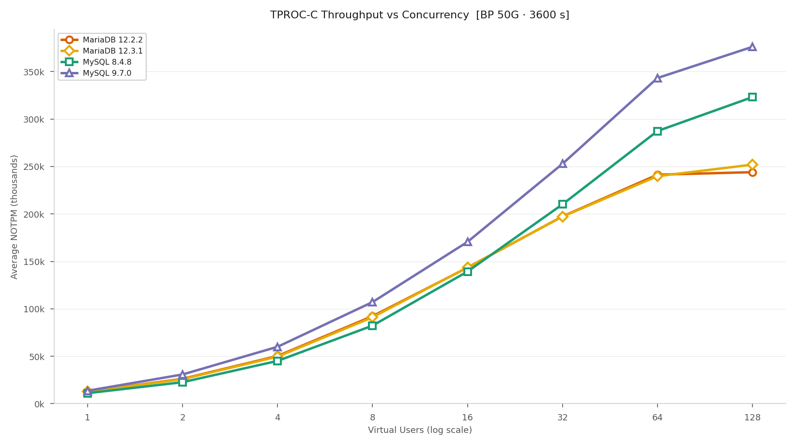
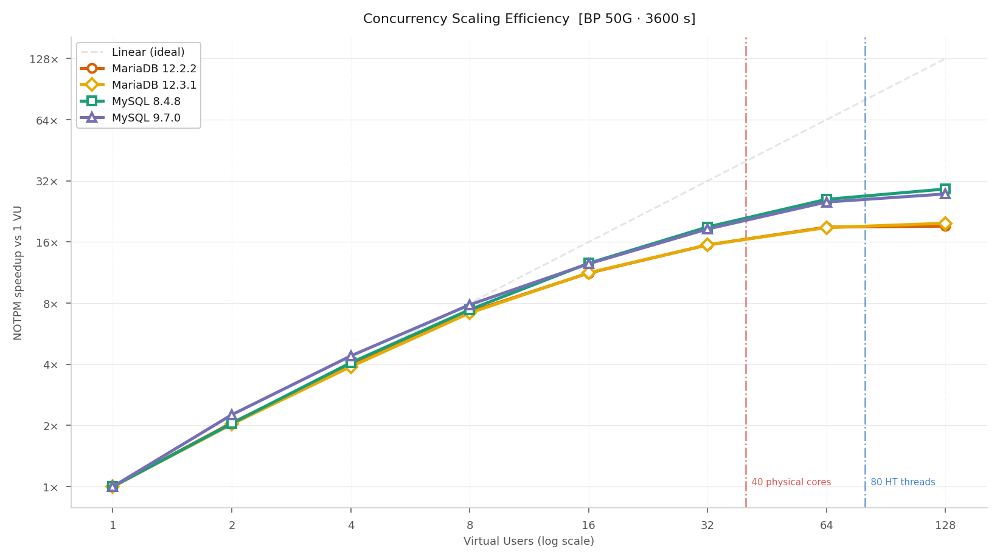
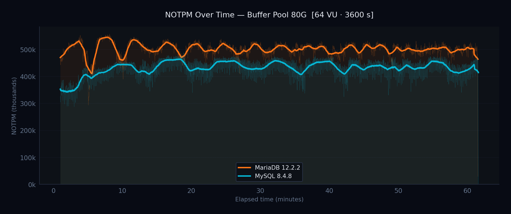
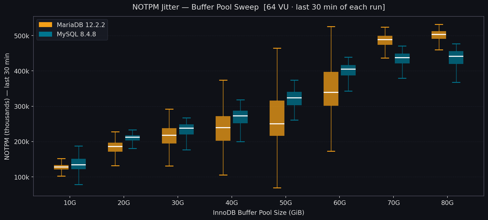
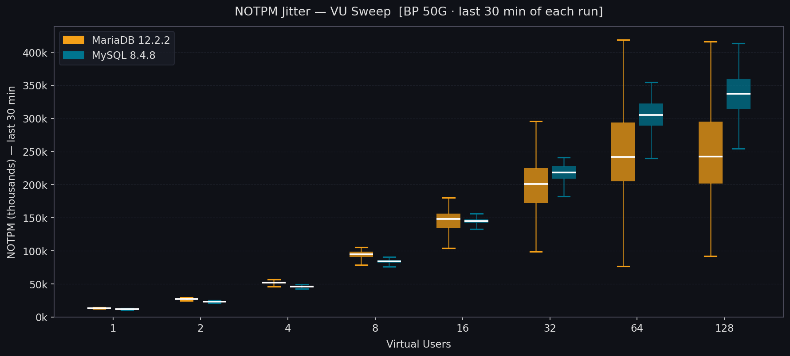

# Database Benchmark Comparison -- TPROC-C Report

**HammerDB 4.12 | TPROC-C | 1000 warehouses | 3600 s runs | 60 s ramp-up**
**Hardware:** Intel Xeon Gold 6230 (2x20c, HT = 80 logical CPUs) | 187 GiB RAM | NVMe 2.9 TB
**OS:** Ubuntu 24.04 | kernel 6.8.0-60-generic | Generated: 2026-04-09
**Engines:** MariaDB 12.2.2, MariaDB 12.3.1, MySQL 8.4.8, MySQL 9.7.0-er2

---

## Executive Summary

| Metric | MariaDB 12.2.2 | MariaDB 12.3.1 | MySQL 8.4.8 | MySQL 9.7.0 |
|--------|---|---|---|---|
| Peak NOTPM (BP 80G, 64 VU) | 465,174 | 454,947 | 404,778 | 459,969 |
| Peak NOTPM (BP 50G, 128 VU) | 244,031 | 251,980 | 323,106 | 376,139 |
| Scaling 1->128 VU (BP 50G) | 19x | 20x | 29x | 28x |

---

## Buffer Pool Sweep -- 64 VU, 10G-80G

The **InnoDB Buffer Pool** is the main memory area where InnoDB caches table data and index
pages. Every read that hits the buffer pool avoids a disk I/O; every miss forces a physical
read from storage. For write-heavy OLTP workloads like TPROC-C, the buffer pool also holds
dirty pages waiting to be flushed -- a larger pool means fewer flush cycles and less I/O
contention between foreground transactions and background flushing.

A **buffer pool sweep** varies this single parameter (from 10 GiB to 80 GiB in 10 GiB steps)
while holding everything else constant -- 64 virtual users, 1000 warehouses (~100 GB working
set), same hardware, same configuration. This isolates the effect of memory pressure on
throughput. At small pool sizes (10-30G) only a fraction of the hot data fits in RAM, so
performance is dominated by disk I/O speed and the engine's read-ahead and flushing strategies.
As the pool grows toward the working set size, more reads hit cache and fewer dirty-page
evictions are needed, revealing the engine's in-memory efficiency.

The 64 VU count was chosen to represent a moderate-to-high concurrency level typical of
production OLTP servers, ensuring that throughput differences reflect buffer pool efficiency
rather than single-thread performance.

| BP Size | MariaDB 12.2.2 | MariaDB 12.3.1 | MySQL 8.4.8 | MySQL 9.7.0 |
|---------|---|---|---|---|
| 10G | 120,150 | 133,515 | **167,616** | 152,895 |
| 20G | 179,193 | 184,512 | 197,955 | **216,523** |
| 30G | 211,528 | 217,949 | 223,770 | **246,461** |
| 40G | 234,908 | 239,255 | 255,862 | **286,086** |
| 50G | 258,203 | 266,403 | 304,495 | **348,729** |
| 60G | 333,987 | 363,492 | 374,112 | **431,681** |
| 70G | **455,697** | 454,947 | 403,396 | 455,581 |
| 80G | **465,174** | 451,869 | 404,778 | 459,969 |

---

## Virtual Users Sweep -- BP 50G, 1-128 VU

A **Virtual User (VU)** is a HammerDB worker thread that simulates an independent database
client. Each VU opens its own connection, picks a random warehouse, and continuously executes
the TPROC-C transaction mix (new-order, payment, delivery, order-status, stock-level) in a
tight loop for the duration of the run. Increasing the VU count is equivalent to increasing
the number of concurrent application threads hitting the database simultaneously.

VU count directly stresses the database engine's concurrency internals: InnoDB row-level
locking, the lock manager, undo/purge scheduling, buffer pool latch contention, and redo log
synchronisation. At low VU counts the engine is mostly CPU- and I/O-bound; as VU rises,
internal latch contention and lock waits become the dominant bottleneck. The point where
throughput plateaus reveals how efficiently the engine scales under parallel workloads -- a
critical metric for multi-tenant and connection-pool-heavy OLTP deployments.

Concurrency was swept from 1 to 128 virtual users with a fixed 50 GiB buffer pool. Each VU
count ran for 3600 seconds with a 60-second ramp-up.

| VU | MariaDB 12.2.2 | MariaDB 12.3.1 | MySQL 8.4.8 | MySQL 9.7.0 |
|----|---|---|---|---|
| 1 | 12,746 | 12,730 | 11,075 | **13,637** |
| 2 | 26,244 | 25,844 | 22,655 | **30,790** |
| 4 | 50,325 | 49,569 | 45,079 | **59,964** |
| 8 | 92,245 | 91,084 | 82,271 | **107,090** |
| 16 | 143,386 | 143,710 | 139,282 | **170,548** |
| 32 | 197,397 | 197,140 | 210,108 | **252,825** |
| 64 | 241,382 | 239,787 | 287,366 | **343,259** |
| 128 | 244,031 | 251,980 | 323,106 | **376,139** |

---

## NOTPM Stability -- BP 50G, 64 VU

**NOTPM Stability** measures how consistently a database sustains its throughput over the entire
duration of a benchmark run. A high average NOTPM is meaningless if the engine periodically
stalls -- background checkpoint flushes, purge operations, or adaptive flushing can cause sharp
dips that ripple through the application as latency spikes.

The chart plots per-second NOTPM for the full 3600-second run (ramp-up excluded) at BP 50G
with 64 virtual users. Thin lines are raw 1-second samples; thick lines are 60-second rolling
averages. A flat rolling average indicates stable throughput; wide oscillations suggest periodic
internal bottlenecks (e.g. InnoDB log checkpointing, buffer pool flushing, or purge lag).

---

## NOTPM Jitter -- last 30 min of each run

**NOTPM Jitter** quantifies the *spread* of second-to-second throughput variation, focusing on
the final 30 minutes of each run when the system has fully warmed up and reached steady state.
While the Stability chart above shows the full time-series shape, jitter distills it into a
single statistical picture: how tightly packed are the per-second NOTPM readings around the mean?

A database with low jitter delivers predictable response times, simplifies capacity planning,
and avoids tail-latency violations under peak load. High jitter forces the application tier to
absorb throughput dips through connection pooling, retry logic, or queuing -- adding complexity
and latency even when the average throughput looks good.

Each box shows the P25-P75 range (interquartile), the centre line is the median, and whiskers
extend to P5-P95. The tables include **CV%** (Coefficient of Variation = std / mean x 100):
a scale-free measure where lower is more stable. Unlike raw standard deviation, CV% is directly
comparable across runs with different mean throughputs.

### Buffer Pool Sweep

| Config | Engine | Mean NOTPM | Std Dev | CV% | P5 | P95 | P5-P95 Range |
|--------|--------|-----------|---------|-----|-----|-----|-------------|
| 10G | MariaDB 12.2.2 | 126,418 | 12,613 | 10.0% | 109,640 | 141,021 | 31,380 |
| 10G | MariaDB 12.3.1 | 134,695 | 14,780 | 11.0% | 109,215 | 151,464 | 42,249 |
| 10G | MySQL 8.4.8 | 139,246 | 48,991 | 35.2% | 87,763 | 159,381 | 71,617 |
| 10G | MySQL 9.7.0 | 159,624 | 16,673 | 10.4% | 130,302 | 180,117 | 49,815 |
| 20G | MariaDB 12.2.2 | 182,344 | 21,580 | 11.8% | 144,327 | 211,933 | 67,606 |
| 20G | MariaDB 12.3.1 | 188,169 | 24,089 | 12.8% | 146,462 | 221,414 | 74,952 |
| 20G | MySQL 8.4.8 | 207,830 | 15,120 | 7.3% | 179,766 | 222,866 | 43,100 |
| 20G | MySQL 9.7.0 | 223,551 | 15,446 | 6.9% | 197,313 | 240,985 | 43,672 |
| 30G | MariaDB 12.2.2 | 214,611 | 31,668 | 14.8% | 162,673 | 260,685 | 98,011 |
| 30G | MariaDB 12.3.1 | 224,012 | 34,930 | 15.6% | 163,984 | 274,941 | 110,956 |
| 30G | MySQL 8.4.8 | 233,896 | 19,083 | 8.2% | 200,901 | 257,158 | 56,257 |
| 30G | MySQL 9.7.0 | 255,990 | 20,261 | 7.9% | 221,265 | 281,017 | 59,752 |
| 40G | MariaDB 12.2.2 | 238,767 | 51,530 | 21.6% | 155,574 | 332,861 | 177,287 |
| 40G | MariaDB 12.3.1 | 248,544 | 58,483 | 23.5% | 158,642 | 355,302 | 196,659 |
| 40G | MySQL 8.4.8 | 269,180 | 24,249 | 9.0% | 228,329 | 302,670 | 74,340 |
| 40G | MySQL 9.7.0 | 298,148 | 27,378 | 9.2% | 253,246 | 335,817 | 82,571 |
| 50G | MariaDB 12.2.2 | 262,605 | 67,457 | 25.7% | 157,164 | 367,607 | 210,443 |
| 50G | MariaDB 12.3.1 | 273,684 | 68,104 | 24.9% | 165,237 | 375,653 | 210,416 |
| 50G | MySQL 8.4.8 | 321,783 | 25,879 | 8.0% | 281,445 | 360,799 | 79,354 |
| 50G | MySQL 9.7.0 | 368,272 | 32,749 | 8.9% | 320,079 | 414,855 | 94,775 |
| 60G | MariaDB 12.2.2 | 345,814 | 65,728 | 19.0% | 240,028 | 445,857 | 205,829 |
| 60G | MariaDB 12.3.1 | 373,464 | 57,717 | 15.5% | 287,901 | 475,767 | 187,866 |
| 60G | MySQL 8.4.8 | 399,532 | 25,176 | 6.3% | 357,574 | 426,392 | 68,817 |
| 60G | MySQL 9.7.0 | 464,147 | 30,760 | 6.6% | 416,022 | 498,856 | 82,833 |
| 70G | MariaDB 12.2.2 | 485,469 | 22,789 | 4.7% | 454,104 | 510,965 | 56,860 |
| 70G | MariaDB 12.3.1 | 483,154 | 23,028 | 4.8% | 455,604 | 503,753 | 48,149 |
| 70G | MySQL 8.4.8 | 431,779 | 25,911 | 6.0% | 387,887 | 458,298 | 70,410 |
| 70G | MySQL 9.7.0 | 491,607 | 32,717 | 6.7% | 435,942 | 529,713 | 93,771 |
| 80G | MariaDB 12.2.2 | 500,087 | 22,272 | 4.5% | 472,162 | 521,336 | 49,173 |
| 80G | MariaDB 12.3.1 | 479,504 | 23,269 | 4.9% | 443,704 | 505,615 | 61,911 |
| 80G | MySQL 8.4.8 | 434,553 | 30,190 | 6.9% | 384,766 | 466,765 | 81,999 |
| 80G | MySQL 9.7.0 | 502,577 | 33,151 | 6.6% | 449,393 | 541,258 | 91,864 |

### Virtual Users Sweep

| Config | Engine | Mean NOTPM | Std Dev | CV% | P5 | P95 | P5-P95 Range |
|--------|--------|-----------|---------|-----|-----|-----|-------------|
| 1 | MariaDB 12.2.2 | 13,549 | 508 | 3.8% | 12,798 | 14,310 | 1,512 |
| 1 | MariaDB 12.3.1 | 13,507 | 473 | 3.5% | 12,744 | 14,256 | 1,512 |
| 1 | MySQL 8.4.8 | 11,817 | 553 | 4.7% | 10,825 | 12,663 | 1,837 |
| 1 | MySQL 9.7.0 | 15,302 | 904 | 5.9% | 13,662 | 16,443 | 2,781 |
| 2 | MariaDB 12.2.2 | 27,149 | 997 | 3.7% | 25,401 | 28,539 | 3,137 |
| 2 | MariaDB 12.3.1 | 26,215 | 1,322 | 5.0% | 24,354 | 28,088 | 3,734 |
| 2 | MySQL 8.4.8 | 23,417 | 784 | 3.3% | 22,135 | 24,705 | 2,569 |
| 2 | MySQL 9.7.0 | 31,936 | 1,113 | 3.5% | 30,213 | 33,480 | 3,267 |
| 4 | MariaDB 12.2.2 | 51,657 | 2,456 | 4.8% | 47,857 | 54,553 | 6,696 |
| 4 | MariaDB 12.3.1 | 50,725 | 2,758 | 5.4% | 46,467 | 54,513 | 8,046 |
| 4 | MySQL 8.4.8 | 46,023 | 1,923 | 4.2% | 43,632 | 48,087 | 4,455 |
| 4 | MySQL 9.7.0 | 61,414 | 2,496 | 4.1% | 58,121 | 64,296 | 6,174 |
| 8 | MariaDB 12.2.2 | 94,080 | 6,507 | 6.9% | 83,299 | 102,136 | 18,837 |
| 8 | MariaDB 12.3.1 | 95,134 | 6,244 | 6.6% | 85,220 | 103,059 | 17,838 |
| 8 | MySQL 8.4.8 | 83,606 | 3,560 | 4.3% | 78,138 | 87,847 | 9,709 |
| 8 | MySQL 9.7.0 | 109,002 | 5,049 | 4.6% | 101,574 | 114,988 | 13,414 |
| 16 | MariaDB 12.2.2 | 146,342 | 16,936 | 11.6% | 117,725 | 174,015 | 56,289 |
| 16 | MariaDB 12.3.1 | 149,168 | 15,804 | 10.6% | 124,259 | 175,365 | 51,105 |
| 16 | MySQL 8.4.8 | 144,436 | 5,888 | 4.1% | 136,127 | 151,233 | 15,106 |
| 16 | MySQL 9.7.0 | 178,097 | 10,932 | 6.1% | 159,985 | 190,412 | 30,426 |
| 32 | MariaDB 12.2.2 | 199,770 | 39,060 | 19.6% | 136,128 | 272,926 | 136,798 |
| 32 | MariaDB 12.3.1 | 202,340 | 38,445 | 19.0% | 141,577 | 270,591 | 129,014 |
| 32 | MySQL 8.4.8 | 216,844 | 14,497 | 6.7% | 194,022 | 234,320 | 40,298 |
| 32 | MySQL 9.7.0 | 264,044 | 19,664 | 7.4% | 233,829 | 293,291 | 59,462 |
| 64 | MariaDB 12.2.2 | 247,214 | 59,515 | 24.1% | 150,984 | 340,362 | 189,378 |
| 64 | MariaDB 12.3.1 | 246,942 | 62,006 | 25.1% | 153,689 | 349,833 | 196,144 |
| 64 | MySQL 8.4.8 | 304,212 | 25,606 | 8.4% | 263,317 | 339,484 | 76,167 |
| 64 | MySQL 9.7.0 | 363,469 | 36,061 | 9.9% | 307,878 | 418,184 | 110,305 |
| 128 | MariaDB 12.2.2 | 247,648 | 64,013 | 25.8% | 148,500 | 365,018 | 216,518 |
| 128 | MariaDB 12.3.1 | 258,214 | 67,266 | 26.1% | 155,294 | 383,591 | 228,297 |
| 128 | MySQL 8.4.8 | 337,400 | 31,942 | 9.5% | 287,348 | 392,310 | 104,961 |
| 128 | MySQL 9.7.0 | 396,141 | 42,013 | 10.6% | 338,482 | 469,503 | 131,020 |

---

## Database Configuration

| Parameter | MariaDB 12.2.2 | MariaDB 12.3.1 | MySQL 8.4.8 | MySQL 9.7.0 | Note |
|-----------|---|---|---|---|------|
| **General** | | | | | |
| `bind-address` | `0.0.0.0` | `0.0.0.0` | `0.0.0.0` | `0.0.0.0` |  |
| `datadir` | `/var/lib/mysql` | `/var/lib/mysql` | `/var/lib/mysql` | `/var/lib/mysql` |  |
| `performance_schema` | `OFF` | `OFF` | `OFF` | `OFF` |  |
| `pid-file` | `/var/run/mysqld/mysqld.pid` | `/var/run/mysqld/mysqld.pid` | `/var/run/mysqld/mysqld.pid` | `/var/run/mysqld/mysqld.pid` |  |
| `port` | `3306` | `3306` | `3306` | `3306` |  |
| `skip-name-resolve` | `ON` | `ON` | `ON` | `ON` |  |
| `socket` | `/var/run/mysqld/mysqld.sock` | `/var/run/mysqld/mysqld.sock` | `/var/run/mysqld/mysqld.sock` | `/var/run/mysqld/mysqld.sock` |  |
| `user` | `mysql` | `mysql` | `mysql` | `mysql` |  |
| **Connections** | | | | | |
| `back_log` | `4096` | `4096` | `4096` | `4096` |  |
| `connect_timeout` | `10` | `10` | `10` | `10` |  |
| `interactive_timeout` | `300` | `300` | `300` | `300` |  |
| `max_connect_errors` | `1000000` | `1000000` | `1000000` | `1000000` |  |
| `max_connections` | `2000` | `2000` | `2000` | `2000` |  |
| `thread_cache_size` | `256` | `256` | `256` | `256` |  |
| `thread_stack` | `512K` | `512K` | `512K` | `512K` |  |
| `wait_timeout` | `300` | `300` | `300` | `300` |  |
| **InnoDB Buffer** | | | | | |
| `innodb_buffer_pool_size` | `80G` | `80G` | `80G` | `80G` |  |
| **InnoDB I/O** | | | | | |
| `innodb_data_file_buffering` | `OFF` | `OFF` | `OFF` | `OFF` | MariaDB only |
| `innodb_data_file_write_through` | `OFF` | `OFF` | `OFF` | `OFF` | MariaDB only |
| `innodb_io_capacity` | `10000` | `10000` | `10000` | `10000` |  |
| `innodb_io_capacity_max` | `20000` | `20000` | `20000` | `20000` |  |
| `innodb_log_file_buffering` | `ON` | `ON` | `ON` | `ON` | MariaDB only |
| `innodb_log_file_write_through` | `OFF` | `OFF` | `OFF` | `OFF` | MariaDB only |
| `innodb_read_io_threads` | `16` | `16` | `16` | `16` |  |
| `innodb_use_native_aio` | `ON` | `ON` | `ON` | `ON` |  |
| `innodb_write_io_threads` | `16` | `16` | `16` | `16` |  |
| **InnoDB Log** | | | | | |
| `innodb_doublewrite` | `ON` | `ON` | `ON` | `ON` |  |
| `innodb_flush_log_at_trx_commit` | `1` | `1` | `1` | `1` |  |
| `innodb_log_buffer_size` | `256M` | `256M` | `256M` | `256M` |  |
| `innodb_log_file_size` | `32G` | `32G` | `32G` | `32G` |  |
| **InnoDB OLTP** | | | | | |
| `innodb_lock_wait_timeout` | `50` | `50` | `50` | `50` |  |
| `innodb_open_files` | `65536` | `65536` | `65536` | `65536` |  |
| `innodb_rollback_on_timeout` | `ON` | `ON` | `ON` | `ON` |  |
| `innodb_snapshot_isolation` | `OFF` | `OFF` | `OFF` | `OFF` | MariaDB only |
| `innodb_stats_on_metadata` | `OFF` | `OFF` | `OFF` | `OFF` |  |
| **Binary Log** | | | | | |
| `binlog_cache_size` | `4M` | `4M` | `4M` | `4M` |  |
| `binlog_format` | `ROW` | `ROW` | `ROW` | `ROW` |  |
| `binlog_row_image` | `MINIMAL` | `MINIMAL` | `MINIMAL` | `MINIMAL` |  |
| `expire_logs_days` | `7` | `7` | `7` | `7` |  |
| `log_bin` | `/var/lib/mysql/mysql-bin` | `/var/lib/mysql/mysql-bin` | `/var/lib/mysql/mysql-bin` | `/var/lib/mysql/mysql-bin` |  |
| `max_binlog_size` | `512M` | `512M` | `512M` | `512M` |  |
| `sync_binlog` | `1` | `1` | `1` | `1` |  |
| **Buffers** | | | | | |
| `bulk_insert_buffer_size` | `256M` | `256M` | `256M` | `256M` |  |
| `join_buffer_size` | `4M` | `4M` | `4M` | `4M` |  |
| `max_heap_table_size` | `256M` | `256M` | `256M` | `256M` |  |
| `read_buffer_size` | `2M` | `2M` | `2M` | `2M` |  |
| `read_rnd_buffer_size` | `4M` | `4M` | `4M` | `4M` |  |
| `sort_buffer_size` | `4M` | `4M` | `4M` | `4M` |  |
| `tmp_table_size` | `256M` | `256M` | `256M` | `256M` |  |
| **Cache / Misc** | | | | | |
| `character_set_server` | `utf8mb4` | `utf8mb4` | `utf8mb4` | `utf8mb4` |  |
| `collation_server` | `utf8mb4_unicode_ci` | `utf8mb4_unicode_ci` | `utf8mb4_unicode_ci` | `utf8mb4_unicode_ci` |  |
| `key_buffer_size` | `64M` | `64M` | `64M` | `64M` |  |
| `max_allowed_packet` | `64M` | `64M` | `64M` | `64M` |  |
| `open_files_limit` | `1000000` | `1000000` | `1000000` | `1000000` |  |
| `query_cache_size` | `0` | `0` | `0` | `0` |  |
| `query_cache_type` | `OFF` | `OFF` | `OFF` | `OFF` |  |
| `table_definition_cache` | `65536` | `65536` | `65536` | `65536` |  |
| `table_open_cache` | `65536` | `65536` | `65536` | `65536` |  |
| **Other** | | | | | |
| `log_queries_not_using_indexes` | `OFF` | `OFF` | `OFF` | `OFF` |  |
| `long_query_time` | `1` | `1` | `1` | `1` |  |
| `min_examined_row_limit` | `1000` | `1000` | `1000` | `1000` |  |
| `myisam_sort_buffer_size` | `128M` | `128M` | `128M` | `128M` |  |
| `slow_query_log` | `ON` | `ON` | `ON` | `ON` |  |
| `slow_query_log_file` | `/var/lib/mysql/slow.log` | `/var/lib/mysql/slow.log` | `/var/lib/mysql/slow.log` | `/var/lib/mysql/slow.log` |  |

---

## Methodology

- **Benchmark:** TPROC-C via HammerDB 4.12 (`tpcc_run.tcl`)
- **Workload:** 1000 warehouses (~100 GB), 60 s ramp-up, 3600 s measurement window
- **Hardware:** Intel Xeon Gold 6230 (2x20 cores, HT = 80 logical CPUs), 187 GiB DDR4, NVMe SSD (2.9 TB)
- **OS:** Ubuntu 24.04, kernel 6.8.0-60-generic
- **Engines:** MariaDB 12.2.2, MariaDB 12.3.1, MySQL 8.4.8, MySQL 9.7.0-er2
- **Metric:** NOTPM = per-second commit rate x 60 x 0.45 (TPROC-C new-order mix is 45%)
- **BP sweep:** 64 VU, buffer pool 10-80 GiB in 10 GiB steps
- **VU sweep:** 50 GiB buffer pool, VU in {1, 2, 4, 8, 16, 32, 64, 128}

---

*Data source: [Percona-Lab-results/tpcc-benchmark-framework](https://github.com/Percona-Lab-results/tpcc-benchmark-framework)*
