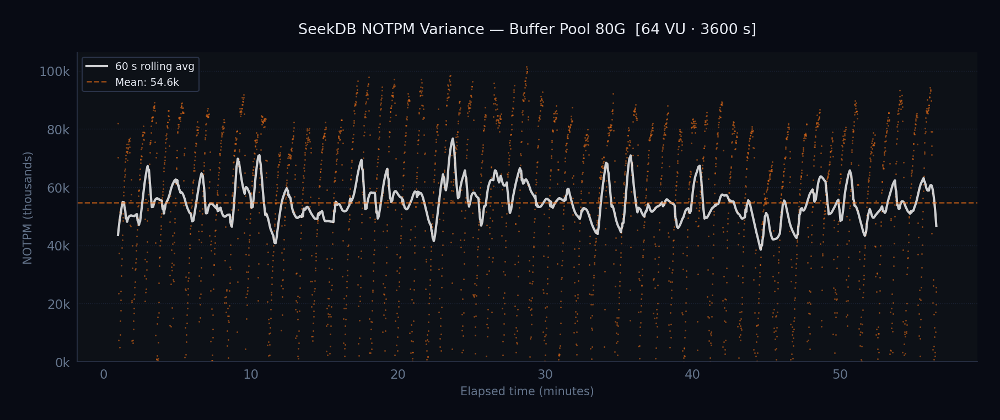

# MySQL 9.7 vs SeekDB -- TPROC-C Benchmark Report

**HammerDB 4.12 | TPROC-C | 1000 warehouses | 3600 s runs | 60 s ramp-up**
**Hardware:** Intel Xeon Gold 6230 (2x20c, HT = 80 logical CPUs) | 187 GiB RAM | NVMe 2.9 TB
**OS:** Ubuntu 24.04 | kernel 6.8.0-60-generic | Generated: 2026-04-10
**Engines:** MySQL 9.7.0-er2, SeekDB v1.2 (OceanBase-based)

---

## Key Findings

**MySQL 9.7.0** leads at all buffer pool sizes, with a **+742%** advantage
at 80G BP where the working set fits mostly in memory. Both engines show strong throughput
scaling as buffer pool increases from 10G to 80G.

---

## Buffer Pool Sweep -- 64 VU, 10G-80G

Both engines ran TPROC-C with 64 virtual users and buffer pool varied from 10 to 80 GiB.
The dataset is 1000 warehouses (~100 GB), so an 80 GiB pool covers ~80% of hot data.

| BP Size | MySQL 9.7.0 | SeekDB 1.2 | Δ (MySQL vs SeekDB) |
|---------|---|---|---|
| 10G | **152,895** | 8,658 | +1665.9% |
| 20G | **216,523** | 15,066 | +1337.2% |
| 30G | **246,461** | 22,653 | +988.0% |
| 40G | **286,086** | 29,106 | +882.9% |
| 50G | **348,729** | 33,995 | +925.8% |
| 60G | **431,681** | 47,927 | +800.7% |
| 70G | **455,581** | 51,183 | +790.1% |
| 80G | **459,969** | 54,645 | +741.7% |

---

## NOTPM Stability -- BP 80G, 64 VU

Per-second NOTPM for the best BP 80G run from each engine (thick line = 60-sample rolling average).

---

## SeekDB NOTPM Variance -- BP 80G, 64 VU

Each dot represents a single 1-second NOTPM measurement from the SeekDB BP 80G run. The scatter
reveals the full per-second variance that rolling averages smooth out. The white line is a
60-second rolling average; the dashed line is the overall mean.

**Periodic drops to near-zero** are clearly visible at roughly 60-second intervals throughout
the run. During these drops, throughput collapses for 1-3 seconds before recovering. This
pattern is consistent with SeekDB's (OceanBase) internal compaction or minor freeze cycles,
which periodically stall foreground transactions. Over the steady-state portion, approximately
**53 distinct drop events** were observed with a **median interval of ~60 seconds**. These
periodic stalls are the primary driver of SeekDB's high CV% (48-85%) in the jitter analysis.

---

## NOTPM Jitter -- BP sweep, last 30 min

Each box shows the distribution of per-second NOTPM samples during the final 30 minutes.
**CV%** (Coefficient of Variation = std / mean x 100): lower is more stable.

| Config | Engine | Mean NOTPM | Std Dev | CV% | P5 | P95 | P5-P95 Range |
|--------|--------|-----------|---------|-----|-----|-----|-------------|
| 10G | MySQL 9.7.0 | 159,624 | 16,673 | 10.4% | 130,302 | 180,117 | 49,815 |
| 10G | SeekDB 1.2 | 8,856 | 7,550 | 85.3% | 27 | 24,786 | 24,759 |
| 20G | MySQL 9.7.0 | 223,551 | 15,446 | 6.9% | 197,313 | 240,985 | 43,672 |
| 20G | SeekDB 1.2 | 14,792 | 12,274 | 83.0% | 135 | 35,997 | 35,862 |
| 30G | MySQL 9.7.0 | 255,990 | 20,261 | 7.9% | 221,265 | 281,017 | 59,752 |
| 30G | SeekDB 1.2 | 22,281 | 15,521 | 69.7% | 756 | 46,203 | 45,447 |
| 40G | MySQL 9.7.0 | 298,148 | 27,378 | 9.2% | 253,246 | 335,817 | 82,571 |
| 40G | SeekDB 1.2 | 28,114 | 17,535 | 62.4% | 1,134 | 53,379 | 52,245 |
| 50G | MySQL 9.7.0 | 368,272 | 32,749 | 8.9% | 320,079 | 414,855 | 94,775 |
| 50G | SeekDB 1.2 | 34,365 | 19,609 | 57.1% | 1,512 | 61,776 | 60,264 |
| 60G | MySQL 9.7.0 | 464,147 | 30,760 | 6.6% | 416,022 | 498,856 | 82,833 |
| 60G | SeekDB 1.2 | 46,948 | 23,203 | 49.4% | 7,398 | 79,650 | 72,252 |
| 70G | MySQL 9.7.0 | 491,607 | 32,717 | 6.7% | 435,942 | 529,713 | 93,771 |
| 70G | SeekDB 1.2 | 51,539 | 24,689 | 47.9% | 8,181 | 84,591 | 76,410 |
| 80G | MySQL 9.7.0 | 502,577 | 33,151 | 6.6% | 449,393 | 541,258 | 91,864 |
| 80G | SeekDB 1.2 | 54,114 | 26,282 | 48.6% | 7,344 | 86,994 | 79,650 |

---

## Methodology

- **Benchmark:** TPROC-C via HammerDB 4.12 (`tpcc_run.tcl`)
- **Workload:** 1000 warehouses (~100 GB), 60 s ramp-up, 3600 s measurement window
- **Hardware:** Intel Xeon Gold 6230 (2x20 cores, HT = 80 logical CPUs), 187 GiB DDR4, NVMe SSD (2.9 TB)
- **OS:** Ubuntu 24.04, kernel 6.8.0-60-generic
- **MySQL 9.7.0-er2:** Installed natively on the host, connected via localhost:3306. Same `my.cnf` as all other MySQL/MariaDB runs.
- **SeekDB v1.2.0.0:** Run inside Docker (`oceanbase/seekdb:1.2.0.0`) on the same host. Container: `MEMORY_LIMIT=32G`, `LOG_DISK_SIZE=32G`, `CPU_COUNT=0` (all CPUs), `DATAFILE_MAXSIZE=512G`. Connected via localhost:2881. MySQL-compatible wire protocol.
- **Metric:** NOTPM = per-second commit rate x 60 x 0.45 (TPROC-C new-order mix is 45%)
- **BP sweep:** 64 VU, buffer pool 10-80 GiB in 10 GiB steps. MySQL: `innodb_buffer_pool_size` varied per step. SeekDB: `MEMORY_LIMIT=32G` fixed (OceanBase manages memory internally).
- **Data collection:** SeekDB NOTPM sourced from HammerDB's native `nopm_samples.csv` (per-second TPM from benchmark driver) since `SHOW GLOBAL STATUS` returned zeros for SeekDB's commit/rollback counters. MySQL data collected from both sources and cross-validated.

---

*Data source: [Percona-Lab-results/tpcc-benchmark-framework](https://github.com/Percona-Lab-results/tpcc-benchmark-framework)*
